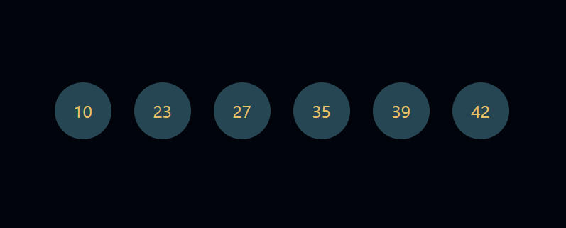

### ※ 현재 구현된 모습

https://codepen.io/pen?template=GRLjwNV

  See the Pen <a href="https://codepen.io/calixlock/pen/GRLjwNV">
  JS_project_02_lotto</a> by calixlock (<a href="https://codepen.io/calixlock">@calixlock</a>)
  on <a href="https://codepen.io">CodePen</a>.

<!--  -->

#### + 업그레이드 하면 좋은 것들

0. 실행/초기화 버튼

1. 누적 데이터 (횟수) 쌓기

2. 데이터 누적에 대한 그래프 표현

3. 원하는 범위 및 갯수 추출 / 실행 횟수 조절
